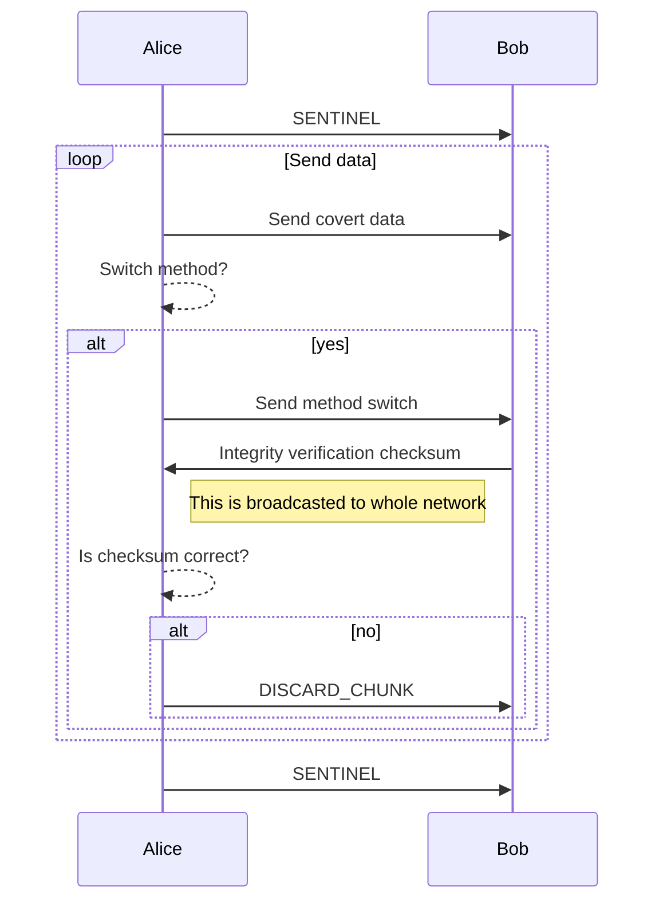
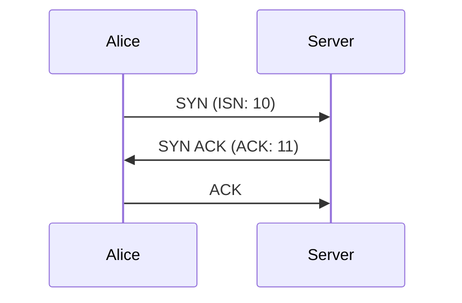
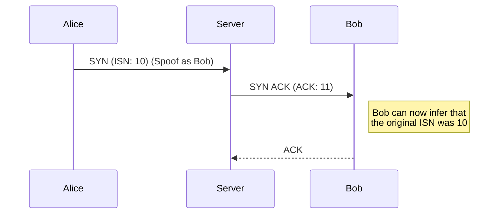

# FaucetFlow

```mermaid
sequenceDiagram
	Alice ->> Bob: SENTINEL
	loop Send data
		Alice ->> Bob: Send covert data
		Alice -->> Alice: Switch method?
		alt yes
			Alice ->> Bob: Send method switch
			Bob ->> Alice: Integrity verification checksum
			Note left of Bob: This is broadcasted to whole network
			Alice -->> Alice: Is checksum correct?
			alt no
				Alice ->> Bob: DISCARD_CHUNK
			end
		end
	end
    Alice ->> Bob: SENTINEL
	
```

# TCP ACK Bounce

## TCPACKNormal

```mermaid
sequenceDiagram
	Alice ->> Server: SYN (ISN: 10)
	Server ->> Alice: SYN ACK (ACK: 11)
	Alice ->> Server: ACK
```

## TCPACKCC

```mermaid
sequenceDiagram
	Alice ->> Server: SYN (ISN: 10) (Spoof as Bob)
	Server ->> Bob: SYN ACK (ACK: 11)
	Note right of Bob: Bob can now infer that<br>the original ISN was 10
	Bob -->> Server: ACK  
	
```