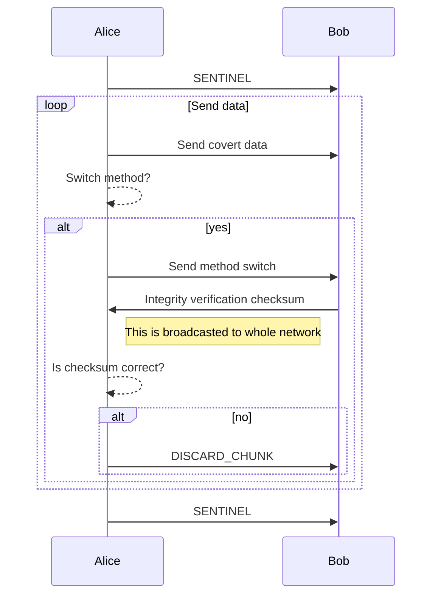
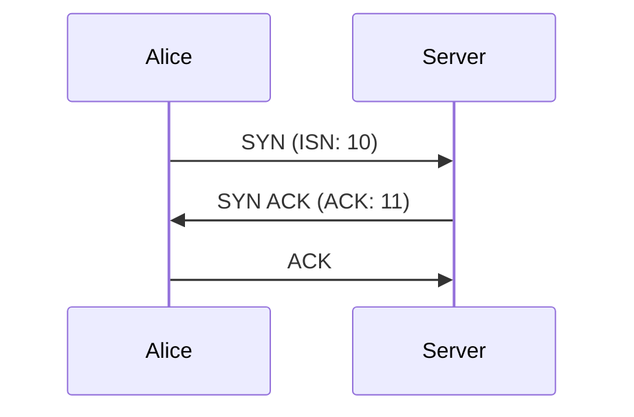
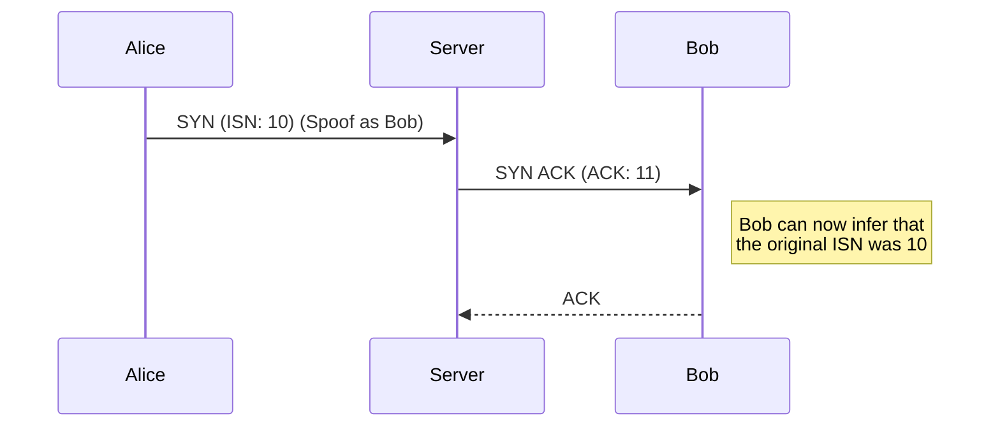
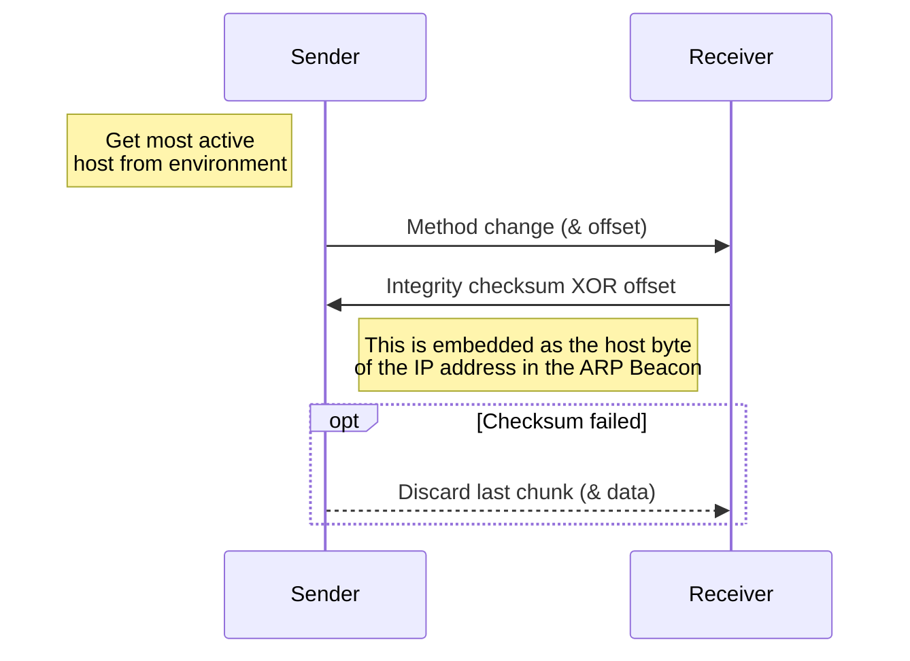
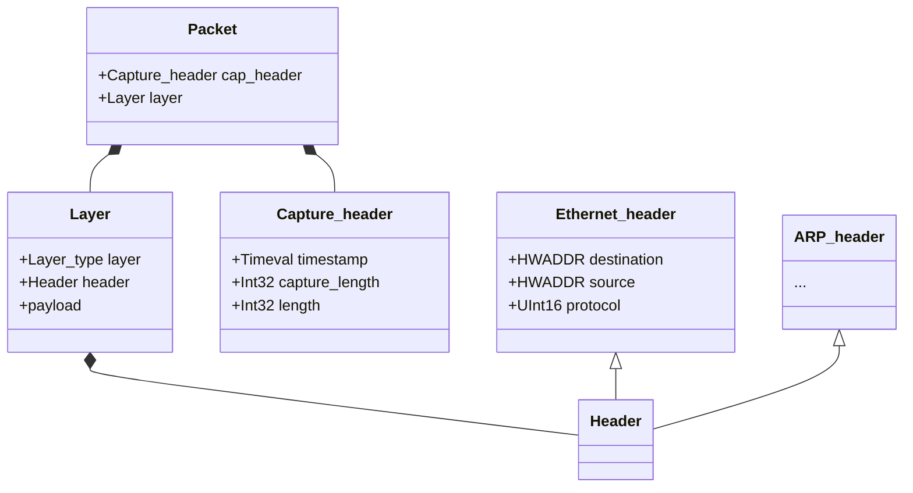

# FaucetFlow

```mermaid
sequenceDiagram
	Alice ->> Bob: SENTINEL
	loop Send data
		Alice ->> Bob: Send covert data
		Alice -->> Alice: Switch method?
		alt yes
			Alice ->> Bob: Send method switch
			Bob ->> Alice: Integrity verification checksum
			Note left of Bob: This is broadcasted to whole network
			Alice -->> Alice: Is checksum correct?
			alt no
				Alice ->> Bob: DISCARD_CHUNK
			end
		end
	end
    Alice ->> Bob: SENTINEL
	
```

# TCP ACK Bounce

## TCPACKNormal

```mermaid
sequenceDiagram
	Alice ->> Server: SYN (ISN: 10)
	Server ->> Alice: SYN ACK (ACK: 11)
	Alice ->> Server: ACK
```

## TCPACKCC

```mermaid
sequenceDiagram
	Alice ->> Server: SYN (ISN: 10) (Spoof as Bob)
	Server ->> Bob: SYN ACK (ACK: 11)
	Note right of Bob: Bob can now infer that<br>the original ISN was 10
	Bob -->> Server: ACK  
	
```

# Integrity Verification

```mermaid

sequenceDiagram
	Note left of Sender: Get most active<br />host from environment
	Sender ->> Receiver: Method change (& offset)
	Receiver ->> Sender: Integrity checksum XOR offset
	Note left of Receiver: This is embedded as the host byte<br />of the IP address in the ARP Beacon
	opt Checksum failed
		Sender -->> Receiver: Discard last chunk (& data)
	end
```

# Packet structure

```mermaid
classDiagram
	class Packet{
		+Capture_header cap_header
		+Layer layer
	}
	Packet *-- Layer
	Packet *-- Capture_header
	class Capture_header{
		+Timeval timestamp
		+Int32 capture_length
		+Int32 length
	}
	class Layer {
		+Layer_type layer
		+Header header
		+payload
	}
	Layer *-- Header
	class Header
	Ethernet_header <|-- Header
	ARP_header <|-- Header
	class Ethernet_header{
		+HWADDR destination
		+HWADDR source
		+UInt16 protocol
	}
	class ARP_header { ... }
```

